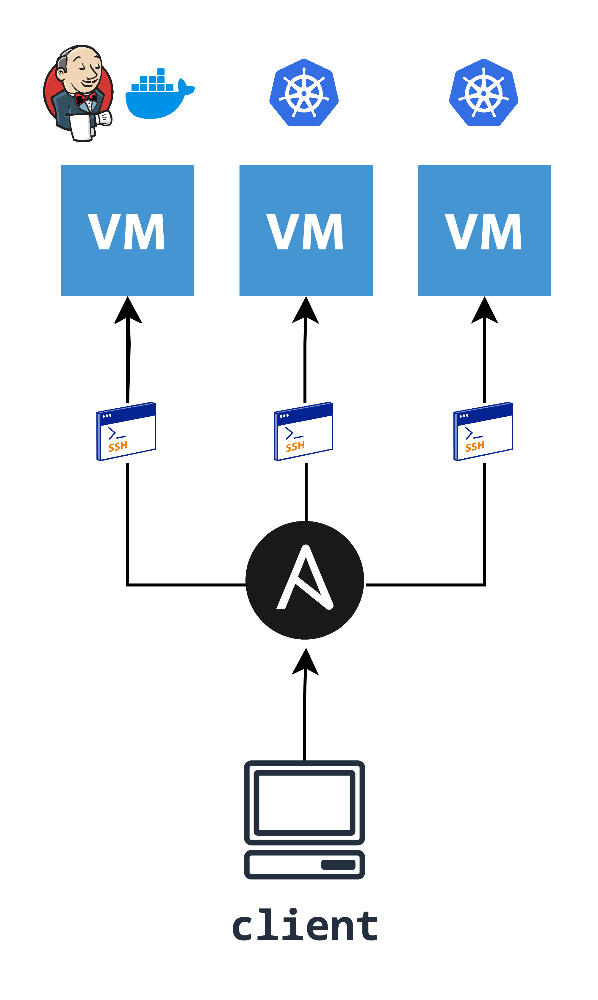
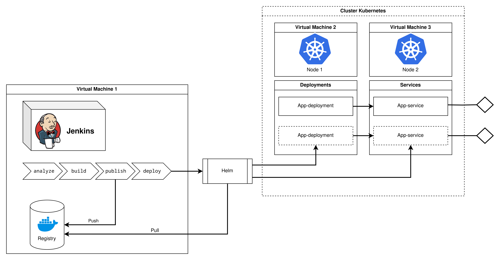

# Whanos

The Whanos project aims at developing an automated pipeline to test, compile and deploy applications written in any languages!

## Prerequisites

Before you begin, ensure you have these packages installed in your machine:
- **Ansible**
- **Git**

## Getting Started

### Deploy the pipeline

Deploying the pipeline is done using **Ansible** and **Git** in two steps:

* To deploy **Kubernetes**, check out : [Kubernetes deployment](Kubernetes/Kubernetes%20deployment.md)
* To deploy **Jenkins** and the **Registry**, check out : [Jenkins deployment](Jenkins/Jenkins%20deployment.md), [Registry deployment](Registry/Registry%20deployment.md)

### Use the pipeline

To use the pipeline, you must understand how to configure your repo and how to launch the Jenkins job:

* To start using your **pipeline**, check out: [Jenkins usage](Jenkins/Jenkins%20usage.md)
* To start **deploying** your apps and **access** them, check out: [Kubernetes usage](Kubernetes/Kubernetes%20usage.md)

## Creators

    <a href="https://github.com/EstusSipper">
        
        
Erwan Gonzales

    </a>
    <a href="https://github.com/rclovis">
        
        
Clovis Rabot

    </a>
    <a href="https://github.com/TotoFunki">
        
        
Théo Liennard

    </a>

